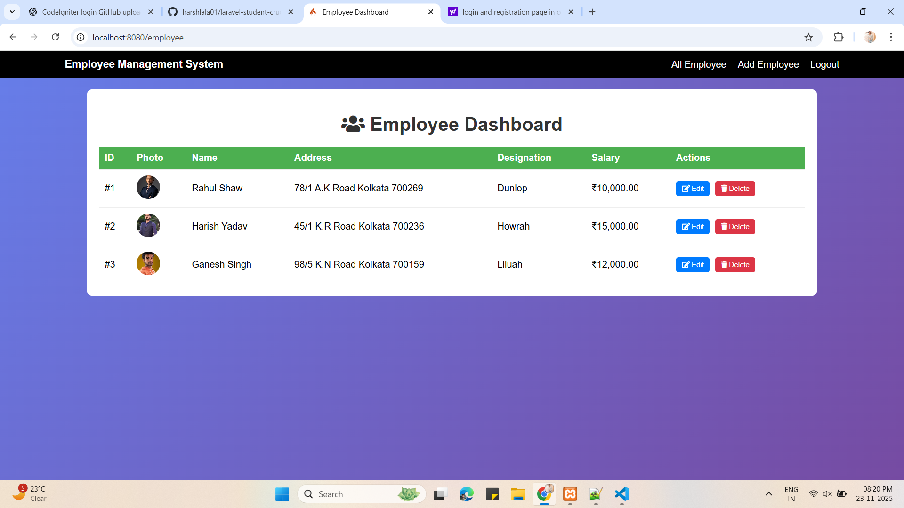
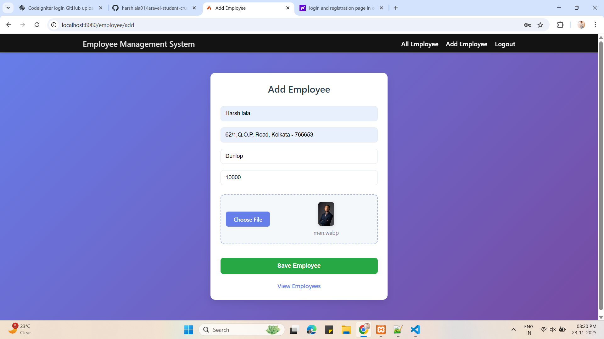

# CodeIgniter 4 Login & CRUD Application

A modern and responsive Login + CRUD (Create, Read, Update, Delete) application built with **CodeIgniter 4** and **MySQL**.  
This project includes secure user authentication, session handling, form validation, and clean MVC-based CRUD operations.  
A perfect beginner-friendly full-stack CodeIgniter project.

---

## Installation & Setup Guide

Follow these simple steps to run the project on your local machine:

### 1️⃣ Clone the Repository
git clone https://github.com/YOURUSERNAME/codeigniter4-login-crud.git
cd codeigniter4-login-crud

### 2️⃣ Install Dependencies (if required)
composer install

### 3️⃣ Configure Environment
Copy the example environment file:
cp env .env

Then update your `.env` file:
- Database name  
- Username  
- Password  

Enable development mode:
CI_ENVIRONMENT = development

### 4️⃣ Run Migrations (If available)
php spark migrate

### 5️⃣ Start the Development Server
php spark serve

### 6️⃣ Open the Application in Browser
http://localhost:8080

---

## Features

- User Login & Logout  
- Secure Authentication  
- Session Handling  
- Form Validation  
- CRUD Operations  
- MVC Architecture  
- Clean & Simple UI  
- CodeIgniter 4 Framework  

---

##  Screenshots

### 📝 Registration Page  

### Login Page  

###  Dashboard  

###  Add Record  

###  Edit Record  

###  Delete Record  
(Add screenshot)

---

